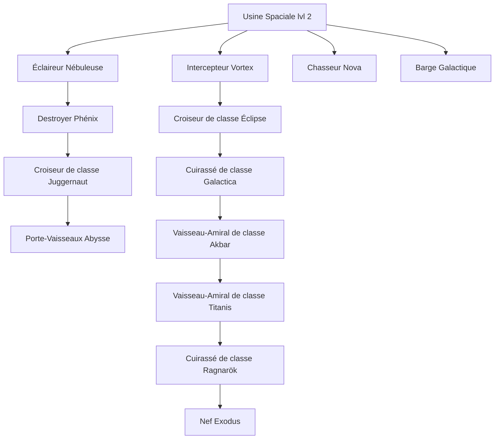

# World of Stars — Référence des Vaisseaux

> Version 1.0 — Document de référence pour les vaisseaux spatiaux.
> Auteur : Antoine Couprie
> Statut : En cours

---

## Table des matières

1. [Introduction](#1-introduction)
2. [Attributs des Vaisseaux](#2-attributs-des-vaisseaux)
3. [Table de Correspondance des Noms](#3-table-de-correspondance-des-noms)
4. [Arbre des Vaisseaux](#4-arbre-des-vaisseaux)
5. [Détails par Vaisseau](#5-détails-par-vaisseau)
6. [Questions Ouvertes](#6-questions-ouvertes)

---

## 1. Introduction

Les vaisseaux dans _World of Stars_ permettent l'exploration, le transport, le combat spatial et la diplomatie. Chaque vaisseau possède des **attributs**, des **coûts de construction**, des **prérequis technologiques** et des **rôles** spécifiques.

Ce document sert de référence centralisée pour tous les vaisseaux disponibles dans le jeu, leurs caractéristiques, et leurs dépendances.

> **Note** : Les vitesses sont exprimées en **% c**, où **% c = pourcentage de la vitesse de la lumière** (ex: 1 % c = 1 % de 299 792 km/s).

---

## 2. Attributs des Vaisseaux

| Attribut                  | Description                                                            |
| ------------------------- | ---------------------------------------------------------------------- |
| **Points de vie**         | Résistance du vaisseau en combat.                                      |
| **Défense (DEF)**         | Réduction des dégâts subis.                                            |
| **Attaque (ATQ)**         | Dégâts infligés en combat spatial.                                     |
| **Intelligence (INT)**    | Impact sur la précision, l'évitement ou d'autres mécaniques de combat. |
| **Vitesse (% c)**         | Vitesse de déplacement en pourcentage de la vitesse de la lumière.     |
| **Capacité**              | Nombre d'unités ou de ressources transportables.                       |
| **Maniabilité**           | Impact sur l'évitement ou la précision en combat (à trancher).         |
| **Coût (Métal)**          | Coût en métal pour la construction.                                    |
| **Coût (Thorium)**        | Coût en thorium pour la construction.                                  |
| **Coût (Nourriture)**     | Coût en nourriture pour la construction.                               |
| **Temps de construction** | Temps nécessaire pour construire le vaisseau (en minutes/heures).      |

---

## 3. Table de Correspondance des Noms

| **Ancien nom**       | **Nouveau nom**                   |
| -------------------- | --------------------------------- |
| Planeur de la mort   | Éclaireur Nébuleuse               |
| X-301                | Intercepteur Vortex               |
| Tel'tak              | Destroyer Phénix                  |
| Chasseur F-302       | Chasseur Nova                     |
| Al'Kesh              | Croiseur de classe Éclipse        |
| Beliskner            | Croiseur de classe Juggernaut     |
| BC-303 Prométhée     | Cuirassé de classe Galactica      |
| Ha'tak               | Porte-Vaisseaux Abysse            |
| BC-304 Dédale        | Vaisseau-Amiral de classe Akbar   |
| Vaisseau mère Asgard | Vaisseau-Amiral de classe Titanis |
| O'neill              | Cuirassé de classe Ragnarök       |
| Jackson              | Nef Exodus                        |
| Transporteur         | Barge Galactique                  |

---

## 4. Arbre des Vaisseaux

---

## 5. Détails par Vaisseau

### Éclaireur Nébuleuse

| Attribut                  | Valeur                                              |
| ------------------------- | --------------------------------------------------- |
| **Temps**                 | 30 m                                                |
| **Points de vie**         | 100                                                 |
| **Défense (DEF)**         | 20                                                  |
| **Attaque (ATQ)**         | 55                                                  |
| **Intelligence (INT)**    | 400                                                 |
| **Vitesse (% c)**         | 1 % c                                             |
| **Capacité**              | 30                                                  |
| **Maniabilité**           | 400                                                 |
| **Coût (Métal)**          | 12000                                               |
| **Coût (Thorium)**        | 2000                                                |
| **Coût (Nourriture)**     | 4000                                                |
| **Bâtiment requis**       | Usine Spaciale lvl 2                                |
| **Technologies requises** | Réacteur inertiel lvl 1, Technologie Naquadah lvl 1 |

---

### Intercepteur Vortex

| Attribut                  | Valeur                                                                           |
| ------------------------- | -------------------------------------------------------------------------------- |
| **Temps**                 | 30 m                                                                             |
| **Points de vie**         | 100                                                                              |
| **Défense (DEF)**         | 20                                                                               |
| **Attaque (ATQ)**         | 70                                                                               |
| **Intelligence (INT)**    | 400                                                                              |
| **Vitesse (% c)**         | 2 % c                                                                            |
| **Capacité**              | 30                                                                               |
| **Maniabilité**           | 400                                                                              |
| **Coût (Métal)**          | 12000                                                                            |
| **Coût (Thorium)**        | 3200                                                                             |
| **Coût (Nourriture)**     | 4000                                                                             |
| **Bâtiment requis**       | Usine Spaciale lvl 3                                                             |
| **Technologies requises** | Maîtrise de l'énergie lvl 2, Réacteur inertiel lvl 2, Technologie Naquadah lvl 2 |

---

### Destroyer Phénix

| Attribut                  | Valeur                                                                               |
| ------------------------- | ------------------------------------------------------------------------------------ |
| **Temps**                 | 40 m                                                                                 |
| **Points de vie**         | 600                                                                                  |
| **Défense (DEF)**         | 20                                                                                   |
| **Attaque (ATQ)**         | 30                                                                                   |
| **Intelligence (INT)**    | 200                                                                                  |
| **Vitesse (% c)**         | 4 % c                                                                                |
| **Capacité**              | 5000                                                                                 |
| **Maniabilité**           | 200                                                                                  |
| **Coût (Métal)**          | 16000                                                                                |
| **Coût (Thorium)**        | 16000                                                                                |
| **Coût (Nourriture)**     | 8000                                                                                 |
| **Bâtiment requis**       | Usine Spaciale lvl 3                                                                 |
| **Technologies requises** | Générateur d'hyperespace lvl 4, Réacteur à Naquadah lvl 5, Technologie Cristal lvl 6 |

---

### Chasseur Nova

| Attribut                  | Valeur                                                                             |
| ------------------------- | ---------------------------------------------------------------------------------- |
| **Temps**                 | 40 m                                                                               |
| **Points de vie**         | 120                                                                                |
| **Défense (DEF)**         | 40                                                                                 |
| **Attaque (ATQ)**         | 150                                                                                |
| **Intelligence (INT)**    | 400                                                                                |
| **Vitesse (% c)**         | 2 % c                                                                              |
| **Capacité**              | 60                                                                                 |
| **Maniabilité**           | 400                                                                                |
| **Coût (Métal)**          | 24000                                                                              |
| **Coût (Thorium)**        | 8000                                                                               |
| **Coût (Nourriture)**     | 2400                                                                               |
| **Bâtiment requis**       | Usine Spaciale lvl 4                                                               |
| **Technologies requises** | Réacteur inertiel lvl 3, Générateur d'hyperespace lvl 1, Technologie Cristal lvl 2 |

---

### Croiseur de classe Éclipse

| Attribut                  | Valeur                                                                                                         |
| ------------------------- | -------------------------------------------------------------------------------------------------------------- |
| **Temps**                 | 60 m                                                                                                           |
| **Points de vie**         | 1000                                                                                                           |
| **Défense (DEF)**         | 100                                                                                                            |
| **Attaque (ATQ)**         | 1000                                                                                                           |
| **Intelligence (INT)**    | 300                                                                                                            |
| **Vitesse (% c)**         | 4 % c                                                                                                          |
| **Capacité**              | 300                                                                                                            |
| **Maniabilité**           | 300                                                                                                            |
| **Coût (Métal)**          | 120000                                                                                                         |
| **Coût (Thorium)**        | 128000                                                                                                         |
| **Coût (Nourriture)**     | 48000                                                                                                          |
| **Bâtiment requis**       | Usine Spaciale lvl 5                                                                                           |
| **Technologies requises** | Générateur d'hyperespace lvl 4, Réacteur à Naquadah lvl 5, Technologie Plasma lvl 3, Technologie Cristal lvl 6 |

---

### Croiseur de classe Juggernaut

| Attribut                  | Valeur                                                                                                     |
| ------------------------- | ---------------------------------------------------------------------------------------------------------- |
| **Temps**                 | 60 m                                                                                                       |
| **Points de vie**         | 1500                                                                                                       |
| **Défense (DEF)**         | 400                                                                                                        |
| **Attaque (ATQ)**         | 900                                                                                                        |
| **Intelligence (INT)**    | 300                                                                                                        |
| **Vitesse (% c)**         | 5 % c                                                                                                    |
| **Capacité**              | 500                                                                                                        |
| **Maniabilité**           | 300                                                                                                        |
| **Coût (Métal)**          | 164000                                                                                                     |
| **Coût (Thorium)**        | 150000                                                                                                     |
| **Coût (Nourriture)**     | 48000                                                                                                      |
| **Bâtiment requis**       | Usine Spaciale lvl 6                                                                                       |
| **Technologies requises** | Générateur d'hyperespace lvl 5, Réacteur Asgard lvl 5, Technologie Cristal lvl 6, Technologie à Ions lvl 5 |

---

### Cuirassé de classe Galactica

| Attribut                  | Valeur                                                                                                         |
| ------------------------- | -------------------------------------------------------------------------------------------------------------- |
| **Temps**                 | 60 m                                                                                                           |
| **Points de vie**         | 2000                                                                                                           |
| **Défense (DEF)**         | 200                                                                                                            |
| **Attaque (ATQ)**         | 750                                                                                                            |
| **Intelligence (INT)**    | 300                                                                                                            |
| **Vitesse (% c)**         | 4 % c                                                                                                          |
| **Capacité**              | 700                                                                                                            |
| **Maniabilité**           | 300                                                                                                            |
| **Coût (Métal)**          | 120000                                                                                                         |
| **Coût (Thorium)**        | 150000                                                                                                         |
| **Coût (Nourriture)**     | 48000                                                                                                          |
| **Bâtiment requis**       | Usine Spaciale lvl 7                                                                                           |
| **Technologies requises** | Générateur d'hyperespace lvl 4, Réacteur à Naquadah lvl 5, Technologie à Ions lvl 4, Technologie Cristal lvl 6 |

---

### Porte-Vaisseaux Abysse

| Attribut                  | Valeur                                                                                                        |
| ------------------------- | ------------------------------------------------------------------------------------------------------------- |
| **Temps**                 | 1 h 20 m                                                                                                      |
| **Points de vie**         | 4000                                                                                                          |
| **Défense (DEF)**         | 500                                                                                                           |
| **Attaque (ATQ)**         | 2500                                                                                                          |
| **Intelligence (INT)**    | 100                                                                                                           |
| **Vitesse (% c)**         | 4 % c                                                                                                         |
| **Capacité**              | 25000                                                                                                         |
| **Maniabilité**           | 100                                                                                                           |
| **Coût (Métal)**          | 200000                                                                                                        |
| **Coût (Thorium)**        | 200000                                                                                                        |
| **Coût (Nourriture)**     | 240000                                                                                                        |
| **Bâtiment requis**       | Usine Spaciale lvl 8                                                                                          |
| **Technologies requises** | Générateur d'hyperespace lvl 4, Réacteur à Naquadah lvl 7, Technologie Plasma lvl 5, Réacteur inertiel lvl 10 |

---

### Vaisseau-Amiral de classe Akbar

| Attribut                  | Valeur                                                                                                                                  |
| ------------------------- | --------------------------------------------------------------------------------------------------------------------------------------- |
| **Temps**                 | 2 h                                                                                                                                     |
| **Points de vie**         | 6000                                                                                                                                    |
| **Défense (DEF)**         | 1000                                                                                                                                    |
| **Attaque (ATQ)**         | 4000                                                                                                                                    |
| **Intelligence (INT)**    | 250                                                                                                                                     |
| **Vitesse (% c)**         | 10 % c                                                                                                                                   |
| **Capacité**              | 10000                                                                                                                                   |
| **Maniabilité**           | 250                                                                                                                                     |
| **Coût (Métal)**          | 640000                                                                                                                                  |
| **Coût (Thorium)**        | 720000                                                                                                                                  |
| **Coût (Nourriture)**     | 480000                                                                                                                                  |
| **Bâtiment requis**       | Usine Spaciale lvl 10                                                                                                                   |
| **Technologies requises** | Technologie Naquadria lvl 8, Technologie à Ions lvl 8, Réacteur Asgard lvl 6, Générateur d'hyperespace lvl 8, Technologie Cristal lvl 8 |

---

### Vaisseau-Amiral de classe Titanis

| Attribut                  | Valeur                                                                                                      |
| ------------------------- | ----------------------------------------------------------------------------------------------------------- |
| **Temps**                 | 2 h                                                                                                         |
| **Points de vie**         | 8000                                                                                                        |
| **Défense (DEF)**         | 2000                                                                                                        |
| **Attaque (ATQ)**         | 4000                                                                                                        |
| **Intelligence (INT)**    | 200                                                                                                         |
| **Vitesse (% c)**         | 10 % c                                                                                                       |
| **Capacité**              | 5000                                                                                                        |
| **Maniabilité**           | 200                                                                                                         |
| **Coût (Métal)**          | 1000000                                                                                                     |
| **Coût (Thorium)**        | 800000                                                                                                      |
| **Coût (Nourriture)**     | 480000                                                                                                      |
| **Bâtiment requis**       | Usine Spaciale lvl 10                                                                                       |
| **Technologies requises** | Générateur d'hyperespace lvl 8, Réacteur Asgard lvl 10, Technologie à Ions lvl 8, Technologie Cristal lvl 8 |

---

### Cuirassé de classe Ragnarök

| Attribut                  | Valeur                                                                                                                                         |
| ------------------------- | ---------------------------------------------------------------------------------------------------------------------------------------------- |
| **Temps**                 | 3 h                                                                                                                                            |
| **Points de vie**         | 30000                                                                                                                                          |
| **Défense (DEF)**         | 3000                                                                                                                                           |
| **Attaque (ATQ)**         | 5000                                                                                                                                           |
| **Intelligence (INT)**    | 200                                                                                                                                            |
| **Vitesse (% c)**         | 20 % c                                                                                                                                         |
| **Capacité**              | 10000                                                                                                                                          |
| **Maniabilité**           | 200                                                                                                                                            |
| **Coût (Métal)**          | 1600000                                                                                                                                        |
| **Coût (Thorium)**        | 1200000                                                                                                                                        |
| **Coût (Nourriture)**     | 1200000                                                                                                                                        |
| **Bâtiment requis**       | Usine Spaciale lvl 12                                                                                                                          |
| **Technologies requises** | Technologie Hyperespace lvl 10, Générateur d'hyperespace lvl 10, Technologie à Ions lvl 12, Réacteur Asgard lvl 12, Technologie Cristal lvl 14 |

---

### Nef Exodus

| Attribut                  | Valeur                                                                                                                                         |
| ------------------------- | ---------------------------------------------------------------------------------------------------------------------------------------------- |
| **Temps**                 | 3 h                                                                                                                                            |
| **Points de vie**         | 40000                                                                                                                                          |
| **Défense (DEF)**         | 5000                                                                                                                                           |
| **Attaque (ATQ)**         | 8000                                                                                                                                           |
| **Intelligence (INT)**    | 200                                                                                                                                            |
| **Vitesse (% c)**         | 20 % c                                                                                                                                         |
| **Capacité**              | 10000                                                                                                                                          |
| **Maniabilité**           | 200                                                                                                                                            |
| **Coût (Métal)**          | 2400000                                                                                                                                        |
| **Coût (Thorium)**        | 1600000                                                                                                                                        |
| **Coût (Nourriture)**     | 1600000                                                                                                                                        |
| **Bâtiment requis**       | Usine Spaciale lvl 14                                                                                                                          |
| **Technologies requises** | Technologie Hyperespace lvl 10, Générateur d'hyperespace lvl 10, Technologie à Ions lvl 14, Réacteur Asgard lvl 12, Technologie Cristal lvl 14 |

---

### Barge Galactique

| Attribut                  | Valeur                                                                           |
| ------------------------- | -------------------------------------------------------------------------------- |
| **Temps**                 | 60 m                                                                             |
| **Points de vie**         | 800                                                                              |
| **Défense (DEF)**         | 30                                                                               |
| **Attaque (ATQ)**         | 10                                                                               |
| **Intelligence (INT)**    | 200                                                                              |
| **Vitesse (% c)**         | 0.5 % c                                                                          |
| **Capacité**              | 20000                                                                            |
| **Maniabilité**           | 200                                                                              |
| **Coût (Métal)**          | 32000                                                                            |
| **Coût (Thorium)**        | 32000                                                                            |
| **Coût (Nourriture)**     | 8000                                                                             |
| **Bâtiment requis**       | Usine Spaciale lvl 6                                                             |
| **Technologies requises** | Maîtrise de l'énergie lvl 6, Réacteur inertiel lvl 7, Technologie Naquadah lvl 8 |

---

## 6. Questions Ouvertes

- **Maniabilité** : Quel impact cet attribut a-t-il sur le combat spatial ? Faut-il le remplacer ou le préciser ?
